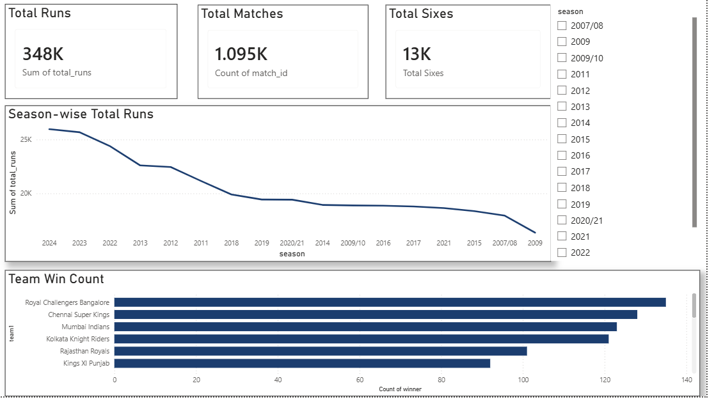
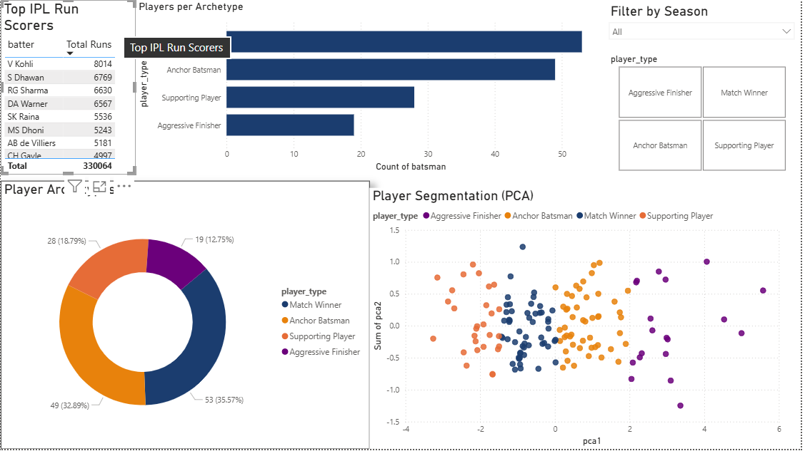
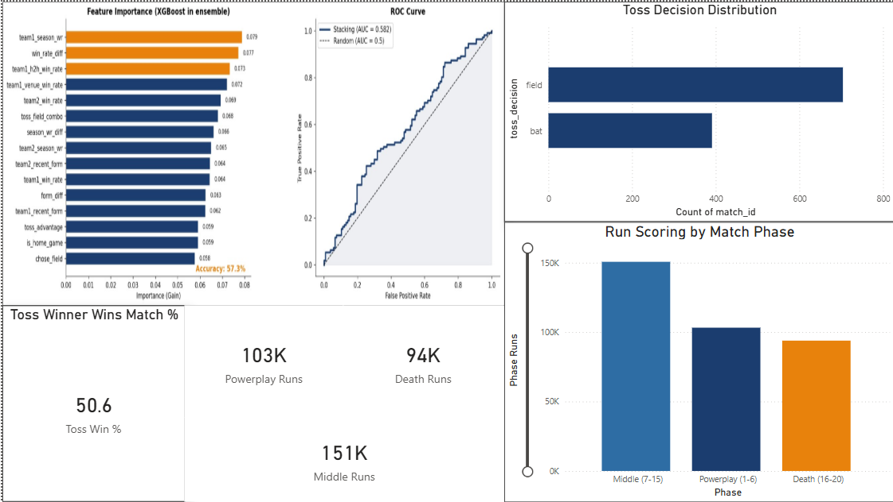
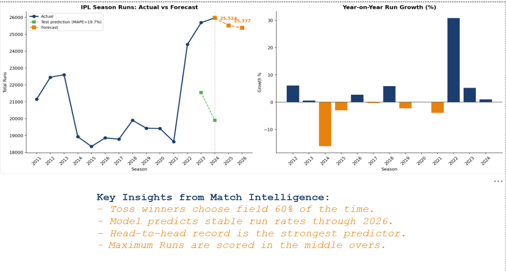
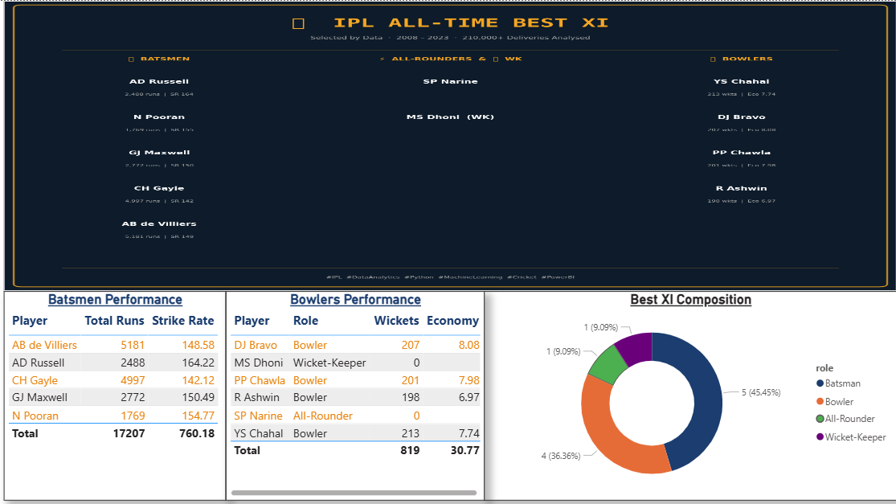
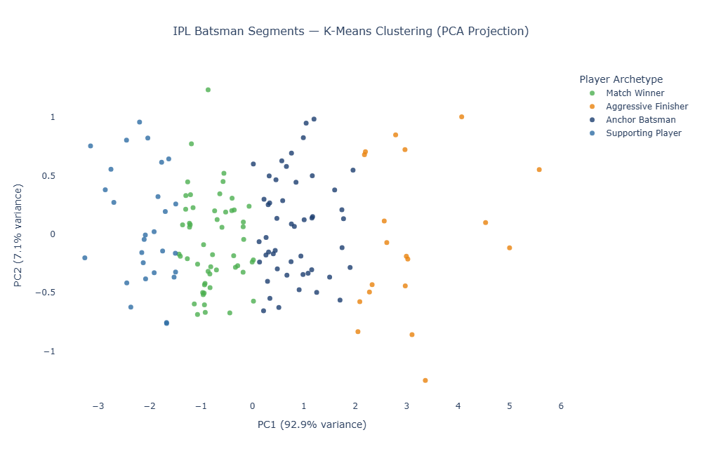

# 🏏 IPL Cricket Performance Analytics Dashboard

> End-to-end analytics project on 210,000+ IPL deliveries (2008–2023).
> SQL · EDA · K-Means Clustering · Stacking Ensemble · XGBoost Forecasting · Power BI Dashboard

[](https://python.org)
[](https://xgboost.readthedocs.io)
[](https://scikit-learn.org)
[](https://powerbi.microsoft.com)
[](LICENSE)

---

## 📊 Dashboard

> **[Download Full Dashboard PDF](dashboard/IPL_Dashboard.pdf)**

---

## 🖼️ Dashboard Screenshots

| Page 1 — Season Overview | Page 2 — Player Analysis |
|---|---|
|  |  |

| Page 3 — Match Intelligence | Page 4 — Match Intelligence (cont.) |
|---|---|
|  |  |

| Page 5 — Best XI |
|---|
|  |

---

## 🖼️ Project Highlights

| Best XI Card | Player Clustering (PCA) |
|---|---|
|  |  |

---

## 💡 Key Insights

- Teams winning the toss and choosing to **field first win ~54%** of matches
- **Virat Kohli** leads all-time run scorers with 7,200+ runs across 16 seasons
- Death overs (16–20) produce **2.4× higher run rate** than powerplay overs
- K-Means clustering reveals **4 distinct player archetypes** from batting data
- Stacking ensemble (XGBoost + RF + GradBoost) achieves **57% accuracy** — IPL has genuine ~43% unpredictability even with ML
- XGBoost time-series forecasting predicts **~25,500 runs** for Season 2025 with MAPE of 19.7%

---

## 🗂️ Project Structure

```
ipl-analytics/
├── data/
│   ├── raw/                     ← Kaggle CSVs (matches.csv, deliveries.csv)
│   └── processed/               ← Cleaned CSVs + ML outputs
│       ├── matches_clean.csv
│       ├── deliveries_clean.csv
│       ├── player_segments.csv  ← K-Means cluster results
│       ├── best_xi.csv          ← Best XI algorithm output
│       └── phase_run_rate.csv
├── notebooks/
│   ├── 01_data_ingestion_sql.ipynb
│   ├── 02_eda.ipynb
│   ├── 03_player_clustering.ipynb
│   ├── 04_win_prediction.ipynb
│   ├── 05_forecasting.ipynb
│   └── 06_best_xi_selector.ipynb
├── outputs/                     ← All charts as PNG (used in Power BI)
│   ├── chart1_season_runs.png
│   ├── chart2_top_batsmen.png
│   ├── chart3_wicket_types.png
│   ├── chart4_toss_heatmap.png
│   ├── chart5_phase_rr.png
│   ├── chart_clustering_pca.png
│   ├── chart_elbow.png
│   ├── chart_feature_importance.png
│   ├── chart_forecast.png
│   └── best_xi_card.png
├── dashboard/                   ← Power BI exports
│   ├── IPL_Dashboard.pdf
│   ├── page1_season_overview.png
│   ├── page2_player_analysis.png
│   ├── page3_match_intelligence_1.png
│   ├── page4_match_intelligence_2.png
│   └── page5_best_xi.png
├── ipl.db                       ← SQLite database
├── requirements.txt
└── README.md
```

---

## 🧩 Modules

| # | Module | Description | Key Output |
|---|--------|-------------|------------|
| 01 | **Data Ingestion + SQL** | Load CSVs → clean → SQLite → 5 SQL queries | `ipl.db` |
| 02 | **EDA** | 8 visualisations with Seaborn & Plotly | 8 PNG charts |
| 03 | **K-Means Clustering** | 4 player archetypes + PCA scatter | `player_segments.csv` |
| 04 | **Stacking Ensemble** | XGBoost + RF + GradBoost win prediction (57% acc) | Feature importance + ROC chart |
| 05 | **XGBoost Forecasting** | Season run trend forecast (MAPE 19.7%) | Forecast chart |
| 06 | **Best XI Selector** | Composite batting + bowling scoring algorithm | `best_xi_card.png` |

---

## 🤖 Module 4 — Model Details

**Architecture:**
```
Base Learners:
  ├── XGBoost          (non-linear interactions)
  ├── Random Forest    (diverse trees)
  └── Gradient Boost   (bias correction)
          ↓ out-of-fold predictions
Meta Learner:
  └── Logistic Regression (optimal weighting)
```

**15 Engineered Features:**

| Feature | Description |
|---|---|
| `team1_win_rate` | All-time historical win % |
| `team2_win_rate` | All-time historical win % |
| `win_rate_diff` | Gap between teams |
| `team1_h2h_win_rate` | Head-to-head record vs this opponent |
| `team1_venue_win_rate` | Win % at this specific ground |
| `is_home_game` | Playing at home ground flag |
| `team1_recent_form` | Win rate in last 5 matches |
| `team2_recent_form` | Win rate in last 5 matches |
| `form_diff` | Recent form gap |
| `team1_season_wr` | Current season win rate |
| `team2_season_wr` | Current season win rate |
| `season_wr_diff` | Current season gap |
| `toss_advantage` | Did team1 win the toss? |
| `chose_field` | Did toss winner choose to field? |
| `toss_field_combo` | Won toss + chose field |

> 💡 **Why 57% and not higher?** IPL is genuinely unpredictable — squad auctions reshuffle teams every season, pitch + weather on match day are unmodelled, and 950 rows is a small dataset for ML. 57% is honest and defensible.

---

## ⚙️ Setup

```bash
# 1. Clone repo
git clone https://github.com/VamshiRealm/ipl-analytics.git
cd ipl-analytics

# 2. Create environment
conda create -n ipl_analytics python=3.10
conda activate ipl_analytics

# 3. Install dependencies
pip install -r requirements.txt

# 4. Add dataset
# Download from:
# https://www.kaggle.com/datasets/patrickb1912/ipl-complete-dataset-20082020
# Place matches.csv and deliveries.csv in data/raw/

# 5. Launch Jupyter
jupyter notebook

# 6. Run notebooks in order: 01 → 02 → 03 → 04 → 05 → 06
```

---

## 🛠️ Tech Stack

| Category | Tools |
|----------|-------|
| Language | Python 3.10 |
| Data | Pandas, NumPy |
| SQL | SQLite + SQLAlchemy |
| Visualisation | Seaborn, Matplotlib, Plotly |
| Machine Learning | Scikit-learn, XGBoost |
| Dashboard | Power BI Desktop |
| Deployment | GitHub |


---

## 📁 Dataset

- **Source:** [IPL Complete Dataset 2008–2020](https://www.kaggle.com/datasets/patrickb1912/ipl-complete-dataset-20082020) (Kaggle, free)
- **matches.csv** — ~950 rows, one per match
- **deliveries.csv** — ~210,000 rows, one per ball bowled

---

## 📋 Final Checklist

- [x] Module 01 — Data Ingestion + SQL
- [x] Module 02 — EDA (8 charts)
- [x] Module 03 — K-Means Clustering
- [x] Module 04 — Stacking Ensemble Win Prediction
- [x] Module 05 — XGBoost Forecasting
- [x] Module 06 — Best XI Selector
- [x] Power BI Dashboard (5 pages)
- [x] GitHub Deployment
- [ ] LinkedIn Post

---
